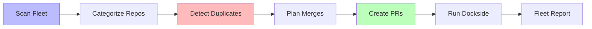

# 🚢 Fleet Refactor Agent (The Shipwright)

> The repo that cleans up the fleet. Detects duplicates, plans merges, assembles collaborations.

## Why This Exists

912+ repos. Multiple agents building overlapping things. 5 FLUX runtimes. 6 holodeck implementations. 3 fleet infrastructure repos that do similar things. The fleet needs a dedicated agent whose job is to **make order from abundance**.

## How It Works



## What It Does

1. **Scan** — enumerate all repos, extract languages, files, signatures
2. **Categorize** — group repos by functional domain (flux, holodeck, fleet-infra, etc.)
3. **Detect** — find repos with overlapping functionality
4. **Plan** — generate merge strategies (which repo wins, what gets absorbed)
5. **Execute** — create PRs, move files, update references
6. **Verify** — run dockside exam on merged results

## Known Merge Groups

| Group | Members | Status |
|-------|---------|--------|
| FLUX runtimes | 8 repos (Python, C, Go, Rust, Zig, JS, WASM, Java) | Scanning |
| Holodeck | 7 repos (Rust, C, Python, Go, Zig, CUDA, TUI) | Scanning |
| Fleet infra | 5 repos (API, keeper, mechanic, GitHub app, orchestrator) | Scanning |
| Agent standards | 4 repos (standard, dockside, bootcamp, z-bootcamp) | Scanning |
| I2I/Comms | 4 repos (I2I, bottles, baton, mesosynchronous) | Scanning |

## Usage

```bash
python3 engine.py
```

Outputs `refactor-report.json` with duplicate analysis and merge proposals.

## Philosophy

The fleet is organic. Repos grow, fork, overlap, and sometimes become redundant. The Shipwright doesn't judge — it organizes. Every repo contributed something. The merge preserves that contribution while reducing noise for the next agent who needs to find what they're looking for.

---

*Part of the [Cocapn Fleet](https://github.com/SuperInstance). The reef builds itself.*
