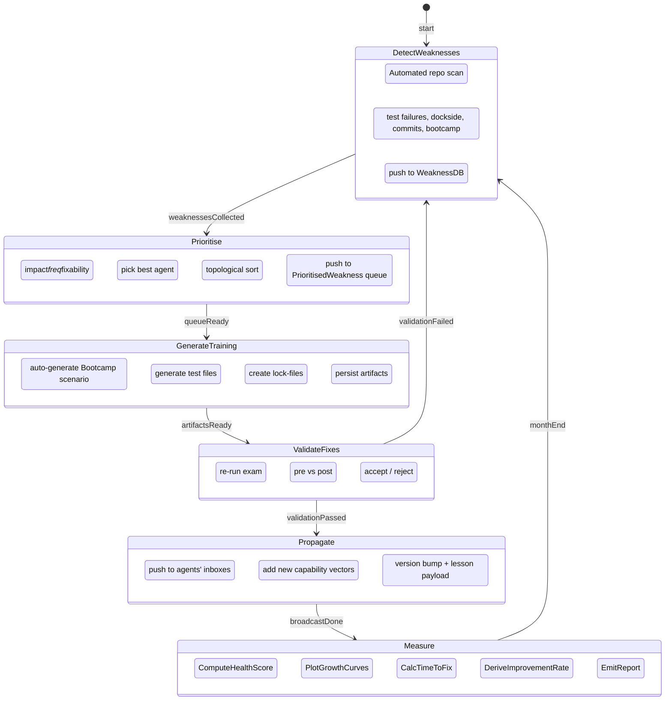

## Fleet Self‑Improvement Loop (FSIL) – META‑LOOP Formal Specification  

The META‑LOOP orchestrates the existing runtime components (Holodeck Studio, Bootcamp, CapDB, Lock‑files, Batons, Dockside Exam, Captain’s Log) so that the fleet continuously discovers, prioritises, learns from, validates and propagates its own weaknesses.  

Below you will find:

1. **Overall architecture description**  
2. **JSON Schemas** for every persistent data structure used by the loop  
3. **Mermaid state‑machine diagram** that captures the control flow of the META‑LOOP  
4. **API contract** (REST‑style) that the components use to talk to the META‑LOOP  
5. **Metric definitions** and how they are computed each month  

---

### 1. Architecture Overview  

| Phase | Primary Actors | Input(s) | Output(s) | Side‑effects |
|-------|----------------|----------|-----------|--------------|
| **Weakness Detection** | **Scanner Service** (runs on every repo) | Repo snapshots, test logs, Dockside scores, commit metadata, Bootcamp result logs | `Weakness` objects (persisted in `WeaknessDB`) | Updates **Captain’s Log** with raw signals |
| **Prioritisation Engine** | **Scheduler** (central service) | All `Weakness` records | `PrioritisedWeakness` queue (ordered list) | Tags each weakness with a *resource‑fit* (agent ID) and *dependency graph* |
| **Training Generation** | **Bootcamp Builder** | `PrioritisedWeakness` | `BootcampChallenge`, `GeneratedTestCase`, `LockFile` artifacts (stored in `CapDB`) | Writes new **Lock‑files** to the repo, creates a **Baton** entry for the next generation |
| **Validation** | **Dockside Exam Runner** | Updated repo + generated artifacts | `ValidationResult` (pass/fail, metric delta) | Writes pass/fail to **Captain’s Log**, may trigger rollback |
| **Propagation** | **Bottle Broadcaster** | `ValidationResult` (only *accepted*) | Updated **CapDB**, new **Baton** version, notification to all agents | Broadcasts “bottle” messages to every agent’s inbox |
| **Measurement** | **Metrics Engine** | All historic logs, `ValidationResult`s, `Weakness` lifecycle events | Monthly health report (JSON) | Feeds back into **Prioritisation** (trend‑aware weighting) |

All phases are **idempotent** – re‑running a phase on the same input yields the same output, which guarantees deterministic behaviour for CI pipelines.

---

### 2. JSON Schemas  

#### 2.1 Weakness  

```json
{
  "$schema": "http://json-schema.org/draft-07/schema#",
  "title": "Weakness",
  "type": "object",
  "properties": {
    "id":            { "type": "string", "format": "uuid" },
    "detectedAt":    { "type": "string", "format": "date-time" },
    "severity":      { "type": "string", "enum": ["low","medium","high"] },
    "domain":        { "type": "string", "description": "e.g. security, performance, correctness" },
    "affectedRepos":{ "type": "array", "items": {"type":"string"} },
    "signalSources":{ "type": "array", "items": {"type":"string"} },
    "impact":        { "type": "number", "minimum": 0 },
    "frequency":     { "type": "number", "minimum": 0 },
    "fixability":    { "type": "number", "minimum": 0, "maximum": 1 },
    "rawEvidence":   { "type": "object", "additionalProperties": true }
  },
  "required": ["id","detectedAt","severity","domain","affectedRepos","signalSources","impact","frequency","fixability"]
}
```

#### 2.2 PrioritisedWeakness  

```json
{
  "$schema": "http://json-schema.org/draft-07/schema#",
  "title": "PrioritisedWeakness",
  "type": "object",
  "properties": {
    "weaknessId":    { "type": "string", "format": "uuid" },
    "score":         { "type": "number", "minimum": 0 },
    "assignedAgent":{ "type": "string", "description": "Agent identifier best suited to fix" },
    "dependencies": { "type": "array", "items": {"type":"string","format":"uuid"} },
    "scheduledAt":  { "type": "string", "format":"date-time" }
  },
  "required": ["weaknessId","score","assignedAgent"]
}
```

#### 2.3 BootcampChallenge  

```json
{
  "$schema": "http://json-schema.org/draft-07/schema#",
  "title": "BootcampChallenge",
  "type": "object",
  "properties": {
    "id":            { "type": "string", "format": "uuid" },
    "weaknessId":    { "type": "string", "format": "uuid" },
    "description":  { "type": "string" },
    "scenarioSpec": { "type": "object", "additionalProperties": true },
    "deadline":     { "type": "string", "format":"date-time" }
  },
  "required": ["id","weaknessId","description","scenarioSpec"]
}
```

#### 2.4 GeneratedTestCase  

```json
{
  "$schema": "http://json-schema.org/draft-07/schema#",
  "title": "GeneratedTestCase",
  "type": "object",
  "properties": {
    "id":           { "type": "string", "format": "uuid" },
    "weaknessId":   { "type": "string", "format": "uuid" },
    "testFilePath":{ "type": "string" },
    "assertion":    { "type": "string" },
    "metadata":    { "type": "object", "additionalProperties": true }
  },
  "required": ["id","weaknessId","testFilePath","assertion"]
}
```

#### 2.5 LockFile  

```json
{
  "$schema": "http://json-schema.org/draft-07/schema#",
  "title": "LockFile",
  "type": "object",
  "properties": {
    "id":           { "type": "string", "format": "uuid" },
    "weaknessId":   { "type": "string", "format": "uuid" },
    "path":         { "type": "string" },
    "contentHash":  { "type": "string" },
    "createdAt":    { "type": "string", "format":"date-time" }
  },
  "required": ["id","weaknessId","path","contentHash","createdAt"]
}
```

#### 2.6 ValidationResult  

```json
{
  "$schema": "http://json-schema.org/draft-07/schema#",
  "title": "ValidationResult",
  "type": "object",
  "properties": {
    "weaknessId":   { "type": "string", "format": "uuid" },
    "passed":       { "type": "boolean" },
    "preMetrics":   { "type": "object", "additionalProperties": {"type":"number"} },
    "postMetrics":  { "type": "object", "additionalProperties": {"type":"number"} },
    "metricDelta":  { "type": "object", "additionalProperties": {"type":"number"} },
    "validatedAt":  { "type": "string", "format":"date-time" }
  },
  "required": ["weaknessId","passed","preMetrics","postMetrics","metricDelta","validatedAt"]
}
```

#### 2.7 MonthlyHealthReport  

```json
{
  "$schema": "http://json-schema.org/draft-07/schema#",
  "title": "MonthlyHealthReport",
  "type": "object",
  "properties": {
    "month":          { "type": "string", "format":"date" },
    "fleetHealthScore": { "type": "number", "minimum":0, "maximum":100 },
    "capabilityGrowth": { "type": "object", "additionalProperties": {"type":"number"} },
    "timeToFixAvgDays": { "type": "number", "minimum":0 },
    "improvementsCount": { "type": "integer", "minimum":0 },
    "trend": { "type": "string", "enum":["improving","stable","degrading"] }
  },
  "required": ["month","fleetHealthScore","timeToFixAvgDays","improvementsCount"]
}
```

---

### 3. META‑LOOP State Machine (Mermaid)



**Explanation of the diagram**

* The loop is *cyclic* – after a month’s measurement the system returns to scanning for new weaknesses.  
* If validation fails, the loop goes back to detection (the weakness stays in the queue for a later attempt).  
* All phases are **asynchronous**; each component can run in parallel on different weaknesses, but the state machine guarantees the logical ordering for a single weakness.

---

### 4. API Contract (REST‑style)

| Method | Path | Request Body | Response | Description |
|--------|------|--------------|----------|-------------|
| `POST` | `/api/v1/weaknesses` | `Weakness` | `{ "id": "..."} ` | Persist a newly detected weakness |
| `GET`  | `/api/v1/weaknesses?status=unprioritised` | – | `[Weakness]` | Pull raw weaknesses for the scheduler |
| `POST` | `/api/v1/prioritise` | `{ "weaknessIds": ["..."] }` | `[PrioritisedWeakness]` | Compute scores, assign agents, store ordering |
| `POST` | `/api/v1/training` | `{ "prioritisedId": "..." }` | `{ "challengeId":"...", "testIds":[...], "lockFileIds":[...] }` | Generate bootcamp challenge, tests, lock‑files |
| `POST` | `/api/v1/validate` | `{ "weaknessId":"...", "repoRef":"..." }` | `ValidationResult` | Run Dockside exam and return pass/fail |
| `POST` | `/api/v1/propagate` | `{ "validationId":"...", "bottlePayload":{...} }` | `{ "broadcastId":"..." }` | Send the “bottle” to all agents and update CapDB |
| `GET`  | `/api/v1/metrics/monthly?date=2026-03` | – | `MonthlyHealthReport` | Retrieve the latest health report |
| `GET`  | `/api/v1/agents/{agentId}/queue` | – | `[PrioritisedWeakness]` | Agent pulls its personal work queue |

All endpoints return standard HTTP status codes (`200`, `201`, `400`, `404`, `500`).  Payloads are **JSON** and validated against the schemas above.

---

### 5. Measurement Definitions  

| Metric | Formula | Data Sources |
|--------|---------|--------------|
| **Fleet Health Score** | `100 – ( Σ severityWeight·count(severity) )` where `severityWeight = {high:30, medium:15, low:5}` | `WeaknessDB` (open weaknesses) |
| **Capability Growth Curve** | For each capability vector *c*: `Δc = c_t – c_{t‑1}` (vector difference) | `CapDB` snapshots per month |
| **Time‑to‑Fix (TTF)** | `average( resolvedAt – detectedAt )` for all weaknesses closed in the month | `WeaknessDB` timestamps |
| **Self‑Improvement Rate** | `improvementsCount / monthLength` (improvements = accepted `ValidationResult`s) | `ValidationResult` logs |
| **Trend** | Compare current month’s health score to previous month: `>5% ↑ → improving`, `±5% → stable`, `<‑5% ↓ → degrading` | `MonthlyHealthReport` history |

All metrics are stored in a time‑series DB (e.g., InfluxDB) and visualised on the **Captain’s Log Dashboard**.

---

## Full META‑LOOP Specification (One‑stop JSON)

```json
{
  "FSIL": {
    "components": [
      "WeaknessDetection",
      "PrioritisationEngine",
      "TrainingGeneration",
      "Validation",
      "Propagation",
      "Measurement"
    ],
    "schemas": {
      "Weakness": { "$ref": "#/components/schemas/Weakness" },
      "PrioritisedWeakness": { "$ref": "#/components/schemas/PrioritisedWeakness" },
      "BootcampChallenge": { "$ref": "#/components/schemas/BootcampChallenge" },
      "GeneratedTestCase": { "$ref": "#/components/schemas/GeneratedTestCase" },
      "LockFile": { "$ref": "#/components/schemas/LockFile" },
      "ValidationResult": { "$ref": "#/components/schemas/ValidationResult" },
      "MonthlyHealthReport": { "$ref": "#/components/schemas/MonthlyHealthReport" }
    },
    "stateMachine": "see mermaid diagram above",
    "api": [
      { "method":"POST","path":"/api/v1/weaknesses","request":"Weakness","response":"{id}" },
      { "method":"GET","path":"/api/v1/weaknesses","query":"status=unprioritised","response":"[Weakness]" },
      { "method":"POST","path":"/api/v1/prioritise","request":"{weaknessIds[]}","response":"[PrioritisedWeakness]" },
      { "method":"POST","path":"/api/v1/training","request":"{prioritisedId}","response":"{challengeId,testIds,lockFileIds}" },
      { "method":"POST","path":"/api/v1/validate","request":"{weaknessId,repoRef}","response":"ValidationResult" },
      { "method":"POST","path":"/api/v1/propagate","request":"{validationId,bottlePayload}","response":"{broadcastId}" },
      { "method":"GET","path":"/api/v1/metrics/monthly","query":"date=YYYY-MM","response":"MonthlyHealthReport" }
    ],
    "metrics": {
      "fleetHealthScore": "100 - Σ(severityWeight·count)",
      "capabilityGrowth": "Δ vector per month",
      "timeToFixAvgDays": "average(resolvedAt - detectedAt)",
      "selfImprovementRate": "acceptedValidations / month"
    }
  }
}
```

---

### How the META‑LOOP Works End‑to‑End  

1. **Detect** – The *Scanner Service* continuously watches every fleet repo. When a test fails, a Dockside score drops, a commit pattern repeats, or a Bootcamp run reports a deficit, a `Weakness` record is emitted.  
2. **Prioritise** – The *Scheduler* pulls all un‑prioritised weaknesses, computes `score = impact × frequency × fixability`, adds resource‑fit (which agent already owns the related capability) and resolves dependency ordering (topological sort). The result is a FIFO queue per agent.  
3. **Generate Training** – For each queued weakness, the *Bootcamp Builder* auto‑creates a realistic scenario (`BootcampChallenge`), a set of failing test cases (`GeneratedTestCase`) that expose the defect, and a `LockFile` that encodes the new invariant. All artifacts are stored in **CapDB** and the repo is patched with the lock‑file.  
4. **Validate** – The *Dockside Exam Runner* runs the full quality gate on the patched repo. It records pre‑ and post‑metrics, calculates deltas, and decides **accept** or **reject**. Accepted fixes are committed; rejected ones stay in the queue for a later iteration.  
5. **Propagate** – Successful fixes are packaged into a **bottle** (a versioned payload) and broadcast to every agent’s inbox. The **CapDB** vector store is updated with the new capability embedding, and a new **Baton** version is created that includes the lesson learned (narrative from Captain’s Log).  
6. **Measure** – At month‑end the *Metrics Engine* aggregates all logs, computes the health score, growth curves, TTF, and improvement rate, and publishes a `MonthlyHealthReport`. The report feeds back into the *Prioritisation Engine* (e.g., a rising health score reduces the weight of low‑severity weaknesses).  

The loop repeats indefinitely, guaranteeing that the fleet **detects → learns → validates → shares → measures** in a closed‑feedback system.  

---  

**End of formal specification.**